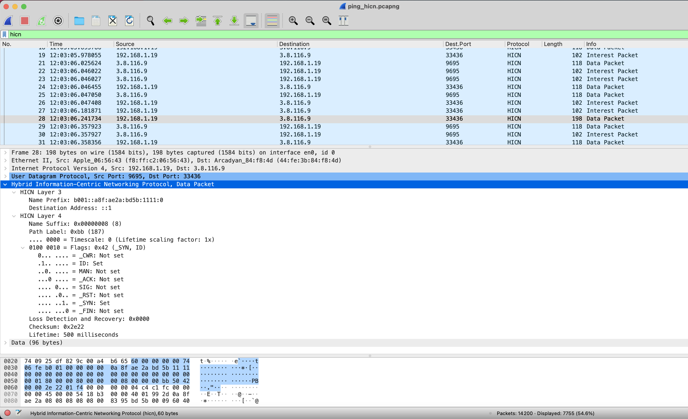

HICN Plugin for Wireshark
===================

This plugin adds support to Wireshark to parse and dissect HICN traffic.

# Linux (Ubuntu)

## Install dependencies
```bash
$ sudo add-apt-repository ppa:wireshark-dev/stable

$ curl -s https://packagecloud.io/install/repositories/fdio/release/script.deb.sh | sudo bash

$ sudo apt install -y build-essential cmake libhicn-dev wireshark wireshark-dev libgcrypt-dev libgnutls28-dev

```
## Compile and install HICN plugin
```bash
$ cd packethicn

$ mkdir build; cd build

$ cmake ..

$ make

$ sudo make install
```


# macOS
If installing wireshark via brew use the `./install_macos.sh` script as shown below:

```bash
$ brew tap icn-team/hicn-tap

$ brew install hicn

$ brew install wireshark

$ brew install cask wireshark

$ cd packethicn

$ ./install_macos.sh
```

Otherwise (if wireshark was compiled from sources) you can follow the setup for Linux:

```bash
$ cd packethicn

$ mkdir build; cd build

$ cmake ..

$ make

$ sudo make install
```
# Example
Below an example of sniffed HICN traffic when using the HICN Plugin for Wireshark

